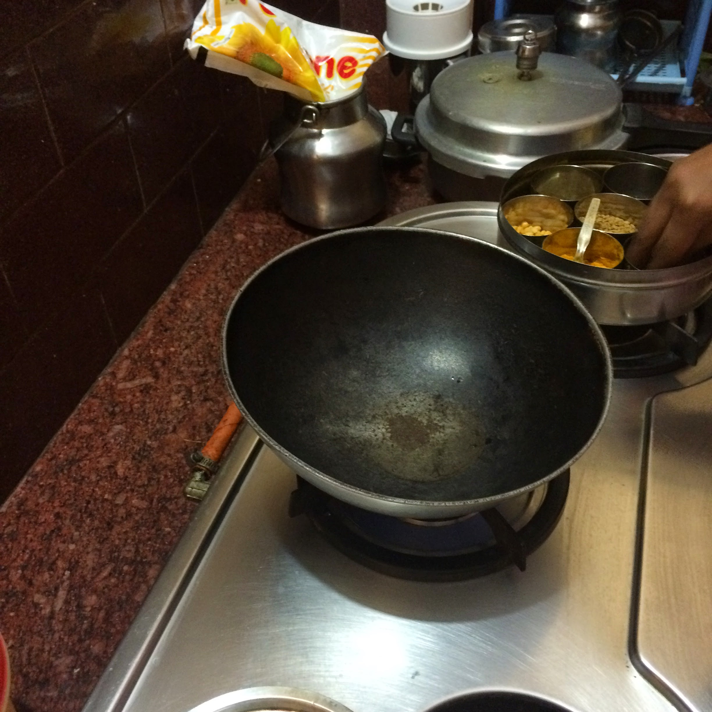
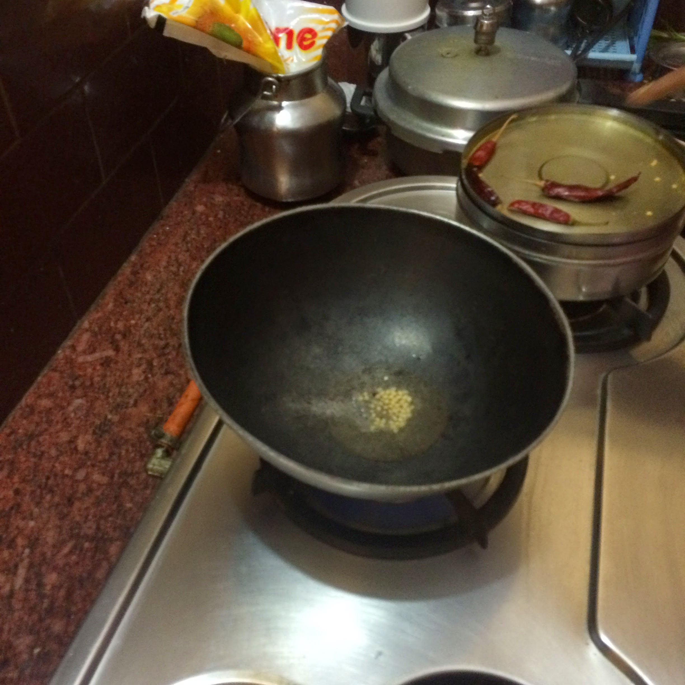
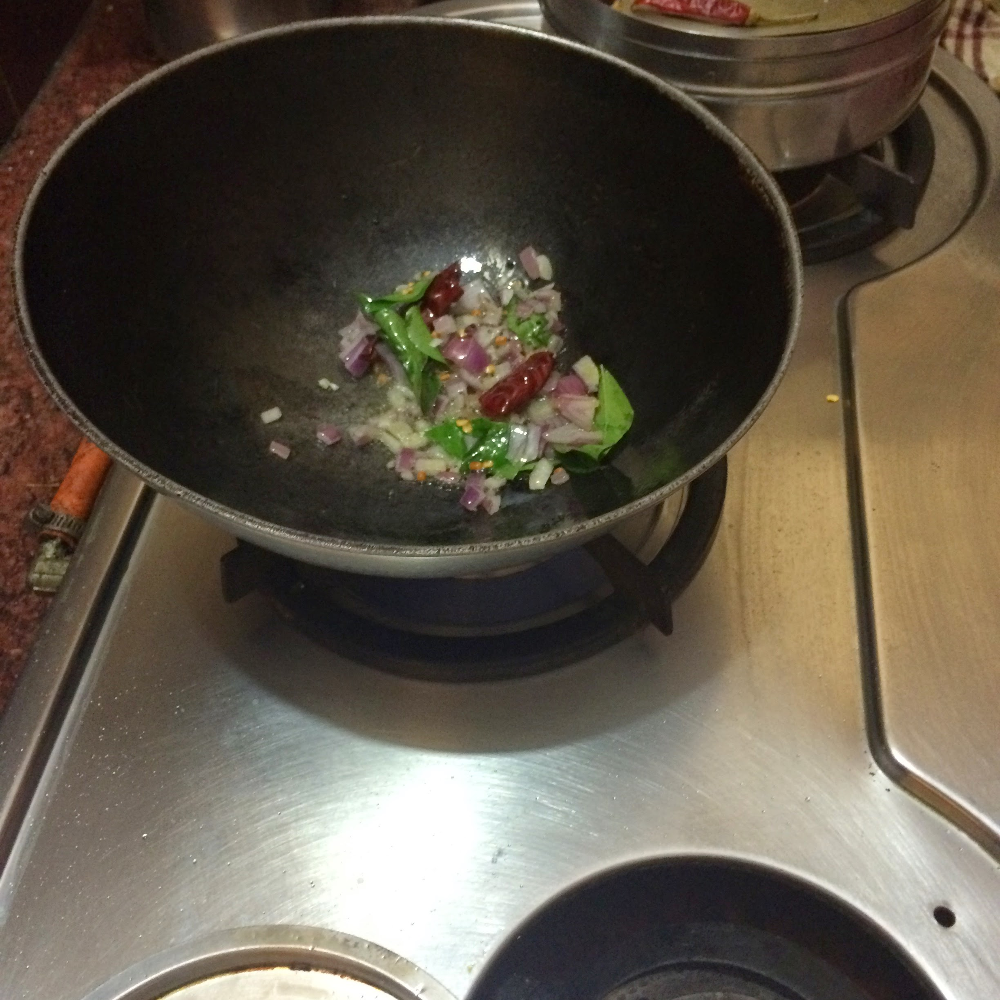
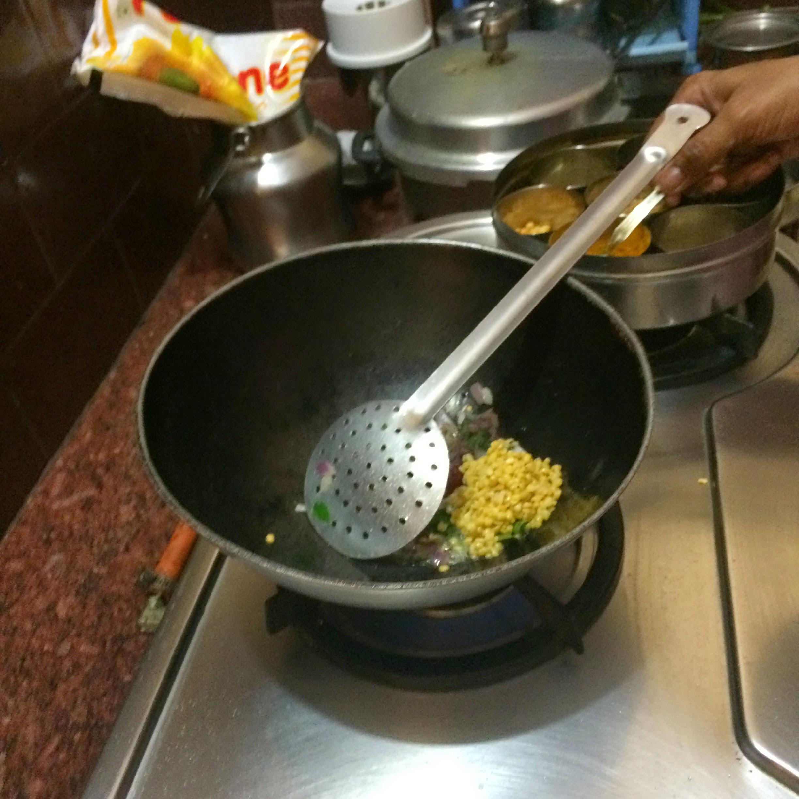
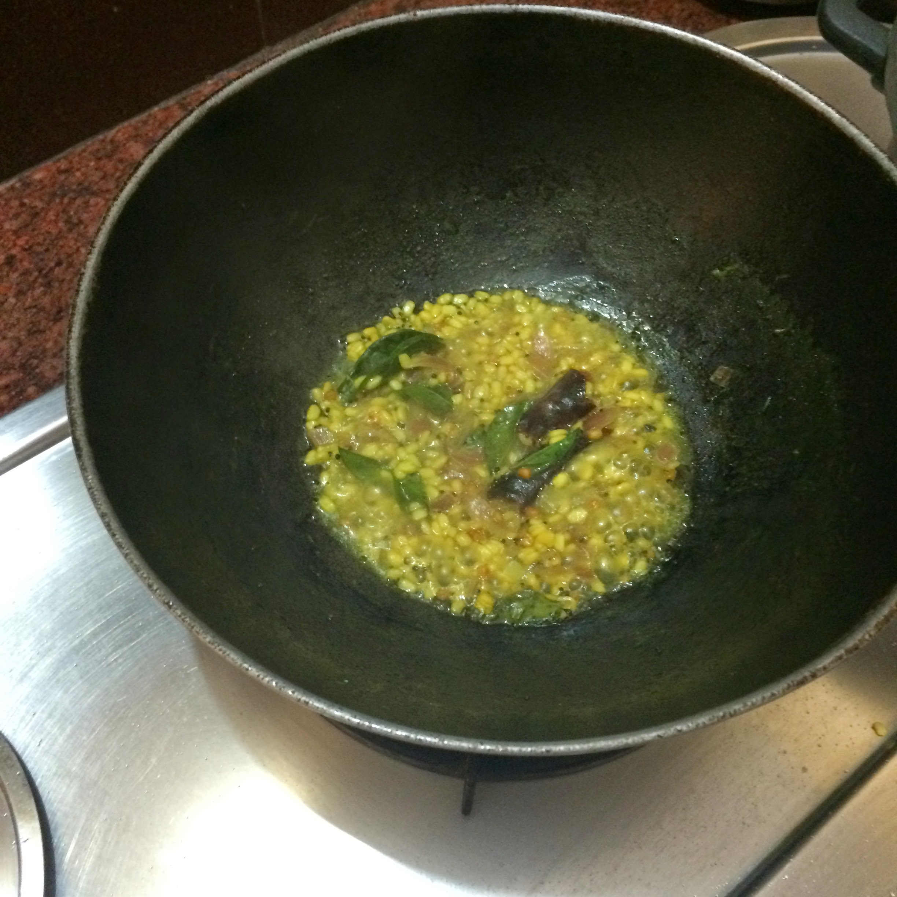
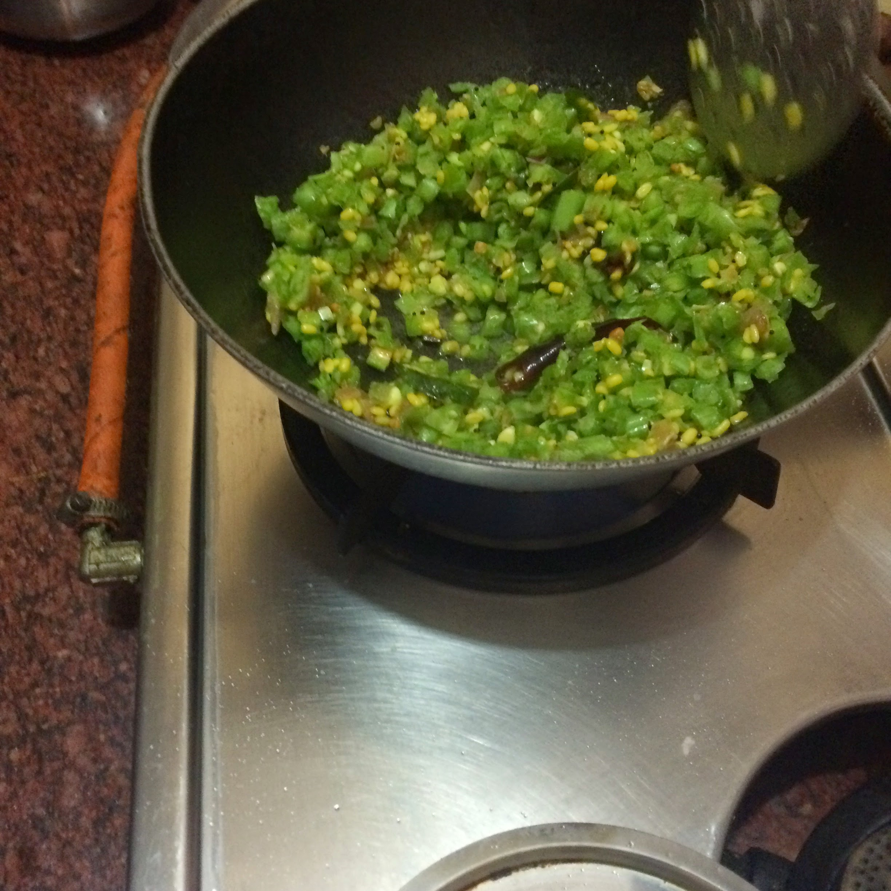
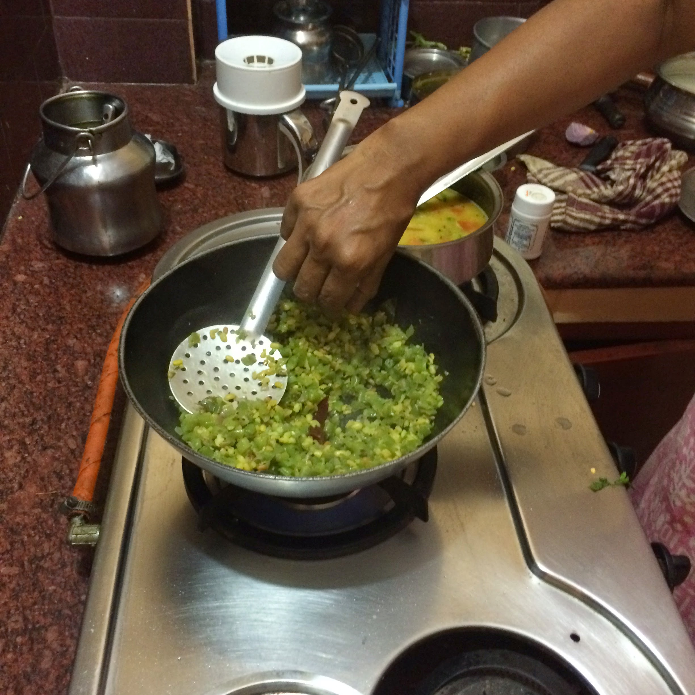
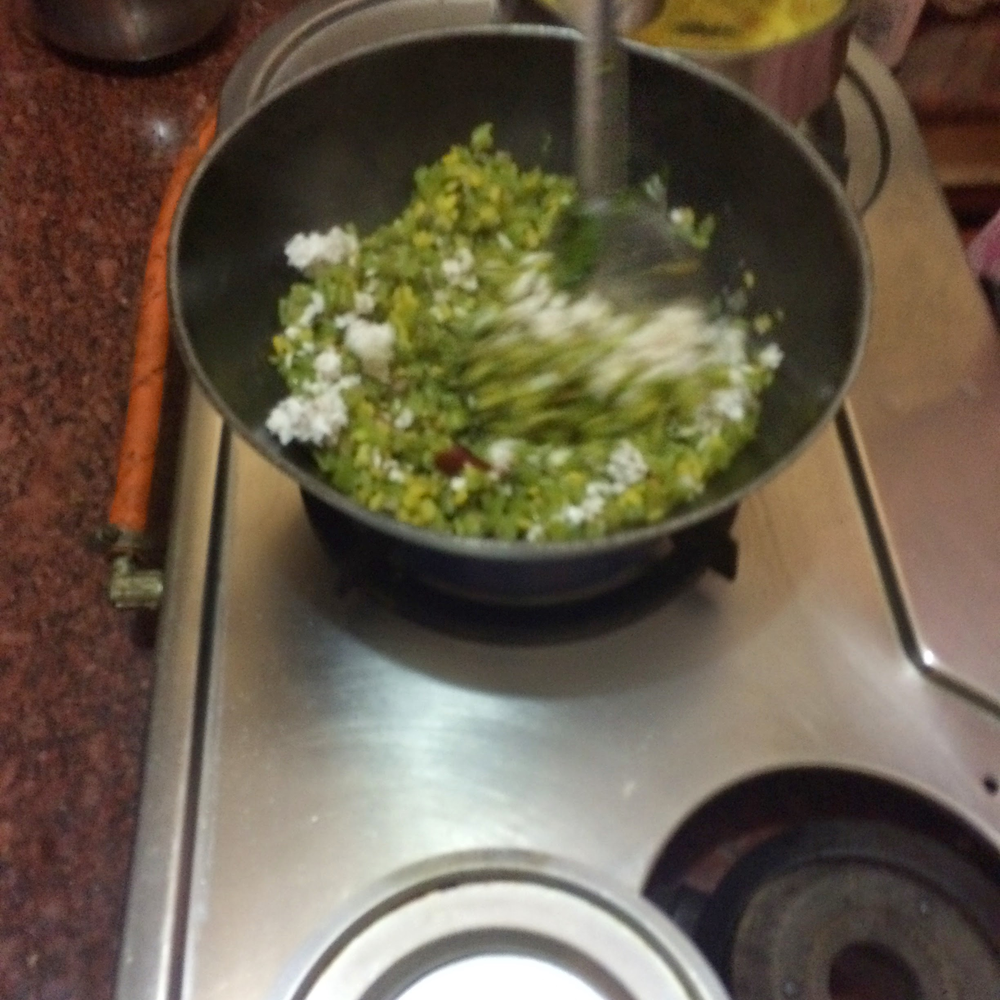
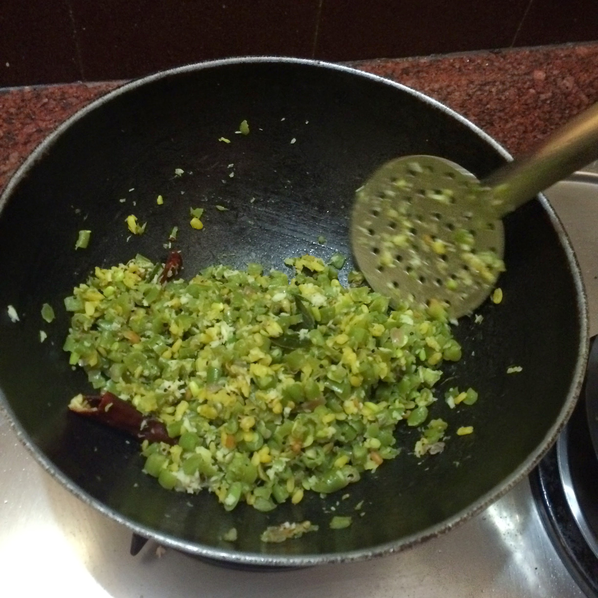

## Beans poriyal

### Method

- Add oil to kadai

- Add mustard, uradh dhal to the oil

- Add 1 red chilli broken into pieces

- Add onions, curry leaves

- Add moong dhal

- Add turmeric and salt to taste

- Add water and cover to let moon dhal boil for 5-10 minutes

- Make sure the dal is soft

- Note - the green beans have not yet been added

- Add green beans when dal is soft

- Add a cup of water

- Cover and allow to cook for 15 minutes

- When beans are cooked sprinkle with grated coconut and serve

### Images of the recipe

