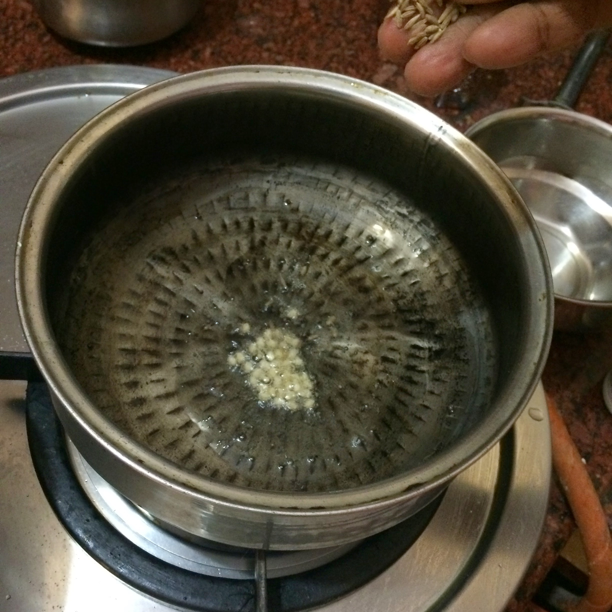
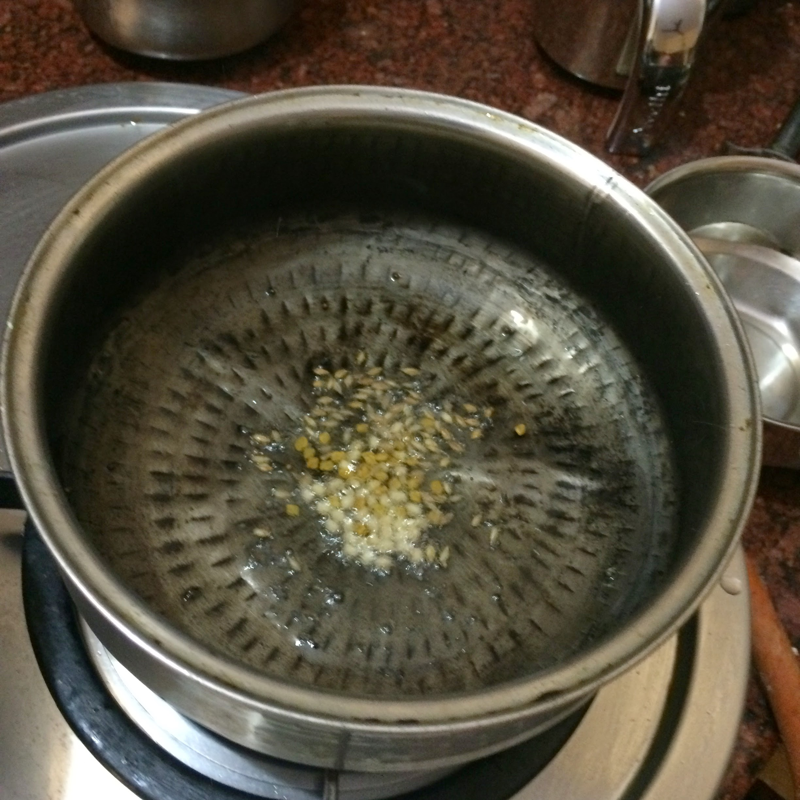
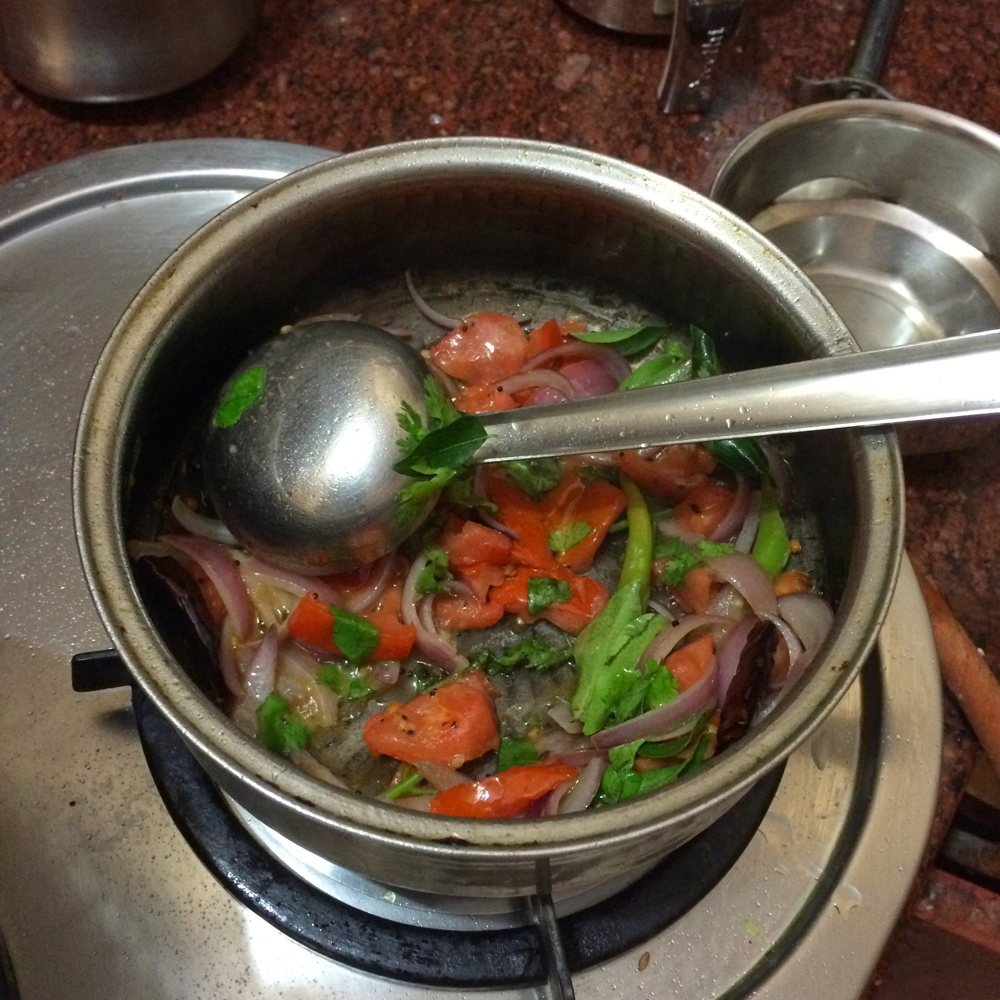
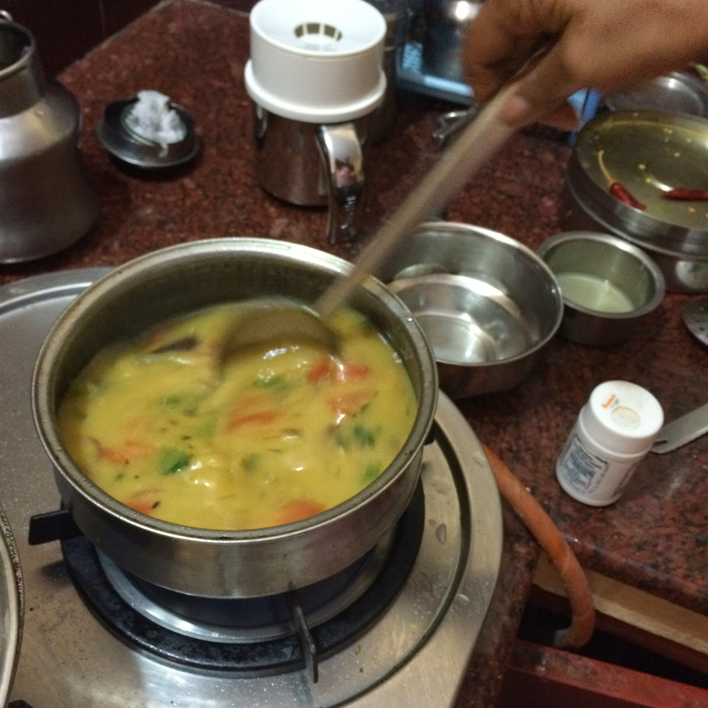
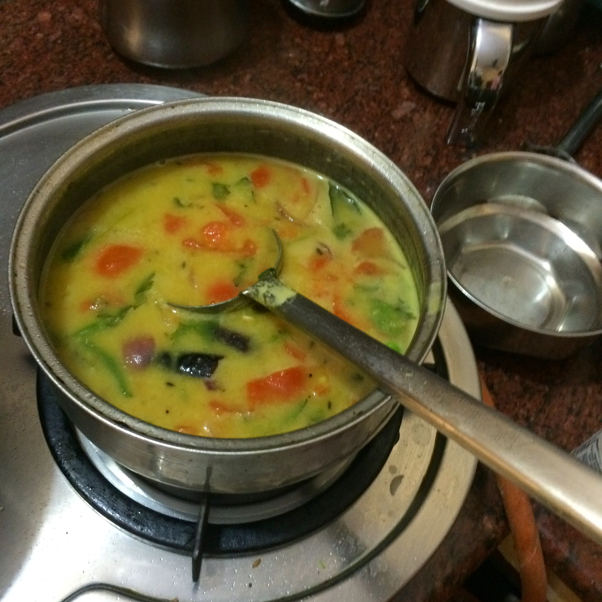

## Lemon sambar

### Method

- Squeeze one lime into a cup

- Add oil, mustard, uradh dal to a pan

- Add jeera, methi seeds to the pan (vendhayam)

- Add red chilli

- Add chopped onions (coarsely chopped, long)

- Add tomatos, green chillis (no other pepper will be added)

- Add a little bit of perungayam (asafoetida)

- Add coriander, curry leaves

- Pressure cook toor dhal, 0.5 cup toor dhal with 2 cups of water and mash

- Pour water from pressure cooker that was used to pressure cook toor dhal into pan

- Add 3 or 4 teaspoons of salt

- Add pressure cooked toor dhal

- Add water to desired consistency

- Add turmeric if needed

- Allow to boil

- Turn off the stove and add squeezed lemon right at the end, do not boil after adding, add
at the end to avoid the bitter taste.

- Add a little bit of water if needed

### Note

It's nice to wash the pressure cooker gasket as soon as you open it after cooking

### Images of the recipe

