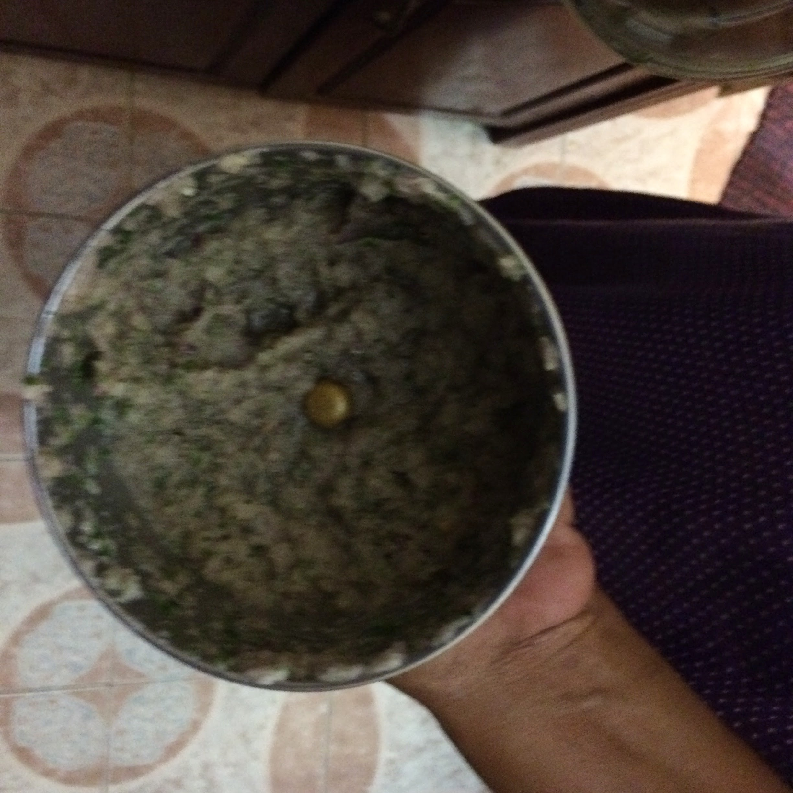
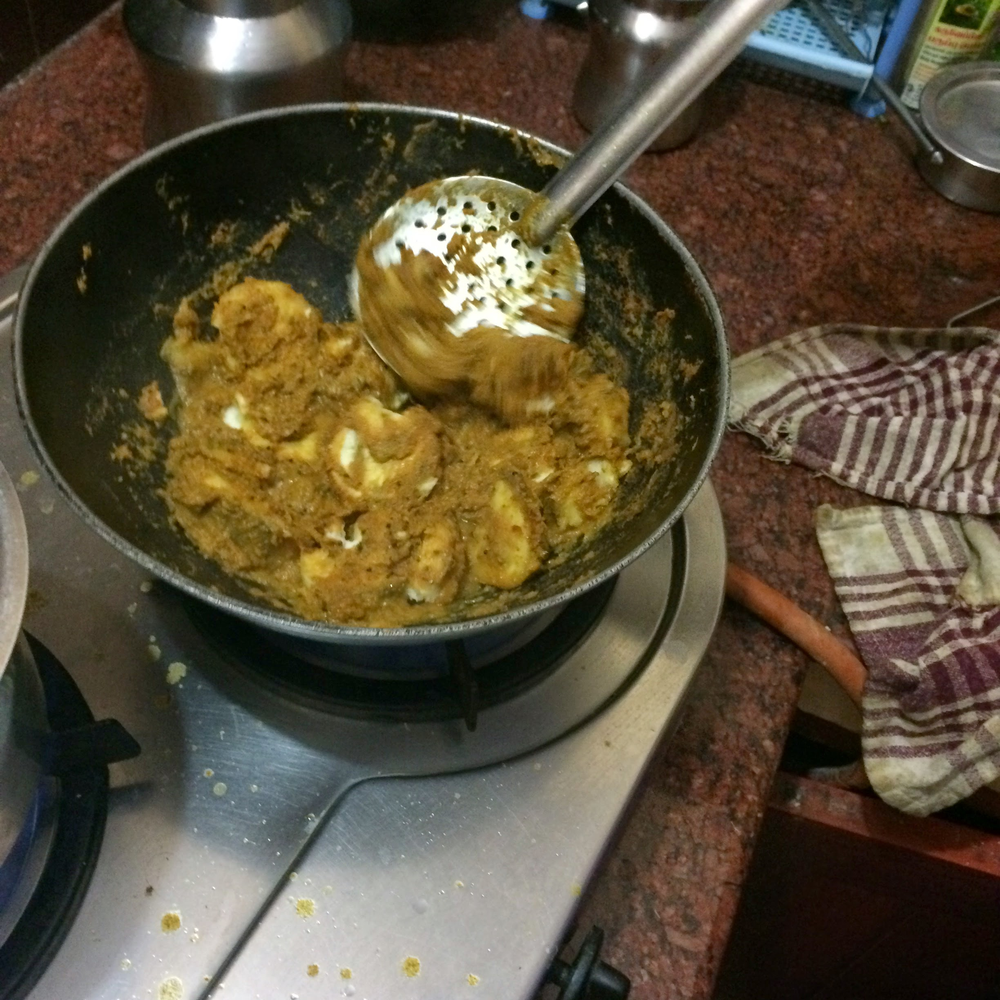

## Vazhakka fry

Vazhakka is very similar to the green plantain(not the sweet kind.)
This recipe is from Radhi Ramu.

### Method

- Cut one onion (Indian size) into chunks, these will be ground up so
larger chunks are ok.

- Peel Ginger, 2 small pieces.

- Garlic is optional

- Add some curry leaves

- Grind onions, ginger-garlic, curry leaves and coriander. Add more onions if you want a thick paste.

- Take a kadai and add mustard and uradh dhaal to oil, heat this.

- Add ground mixture to the kadai when the urad dhal is ready(turns brown, mustard starts to pop)

- Toss and fry a little bit to remove the raw smell of the vegetables

- Add water by cleaning out the mixie jar

- Add a quarter teaspoon of turmeric

- Add 3.5 tbsp of chilli powder and 0.5 teaspoon salt

- Add vazhakka to this mixture

- Add a half a cup or 1 cup of water to this mixture.

- Cover and cook.

Notes - chilli powder that we use at home is red chillis sun-dried and ground with dhaniya, this is less harmful than
just red chillis found in the store.

### Images of the recipe

