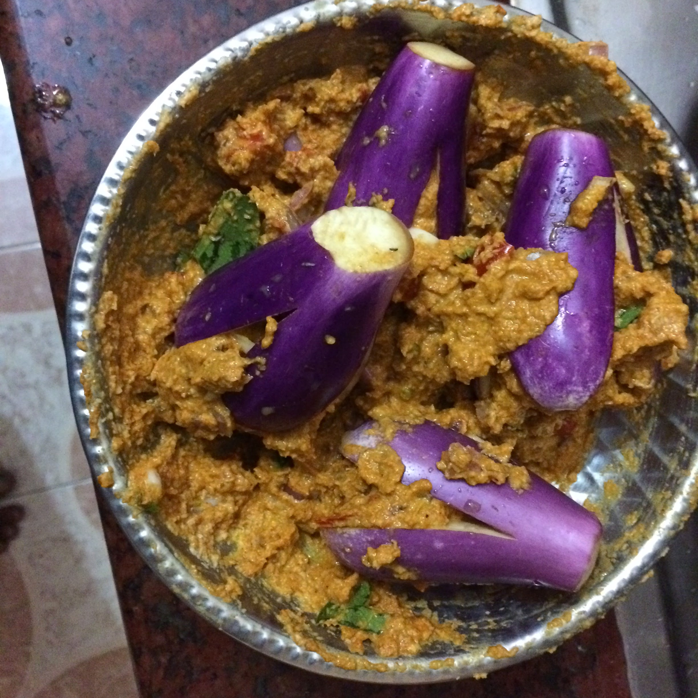
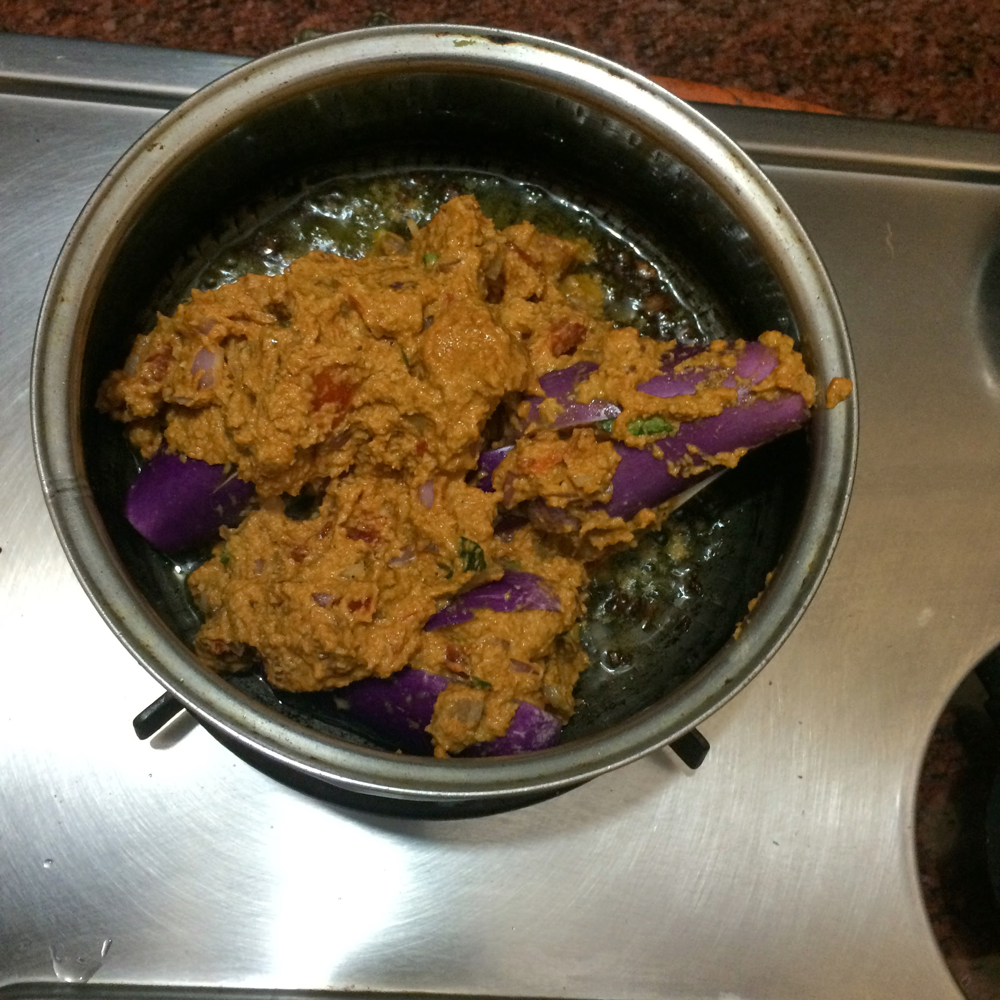
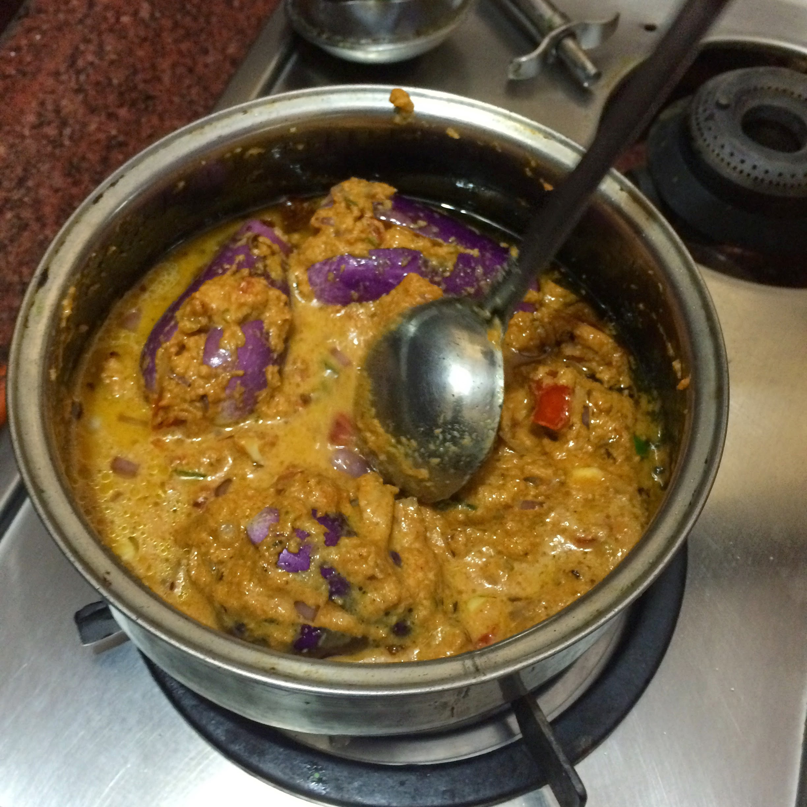
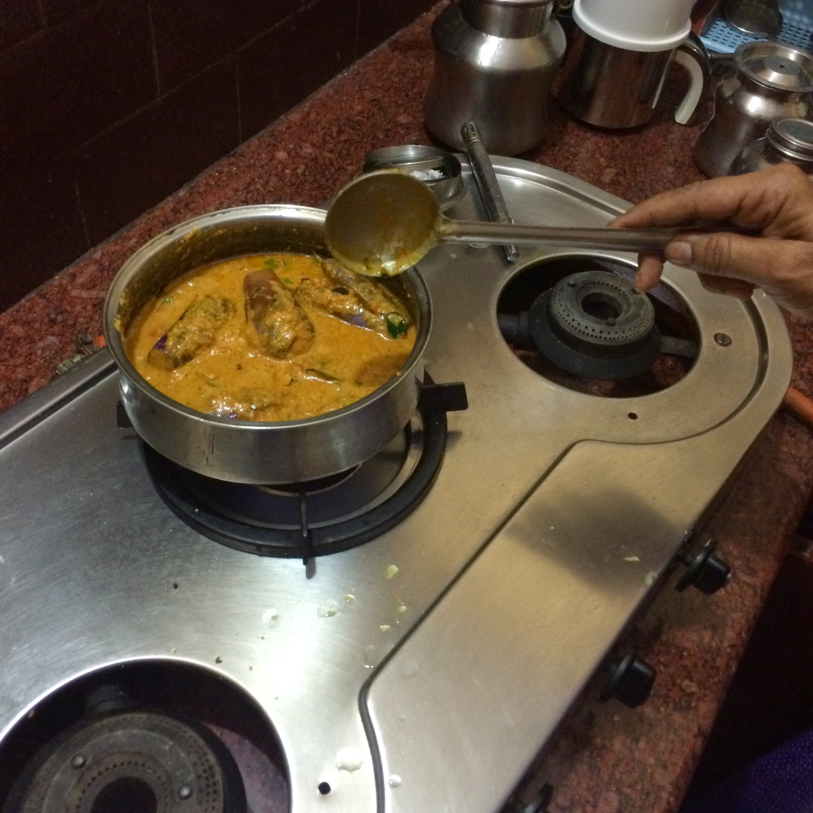
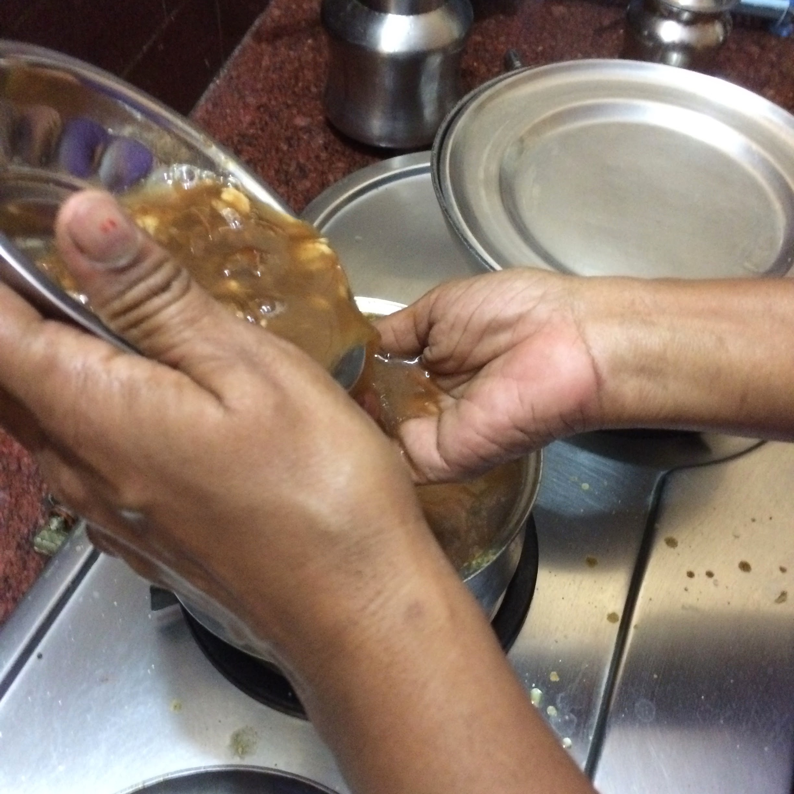
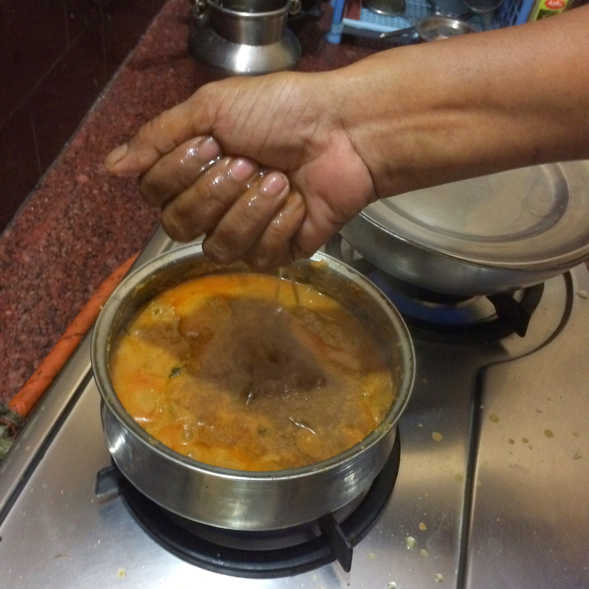
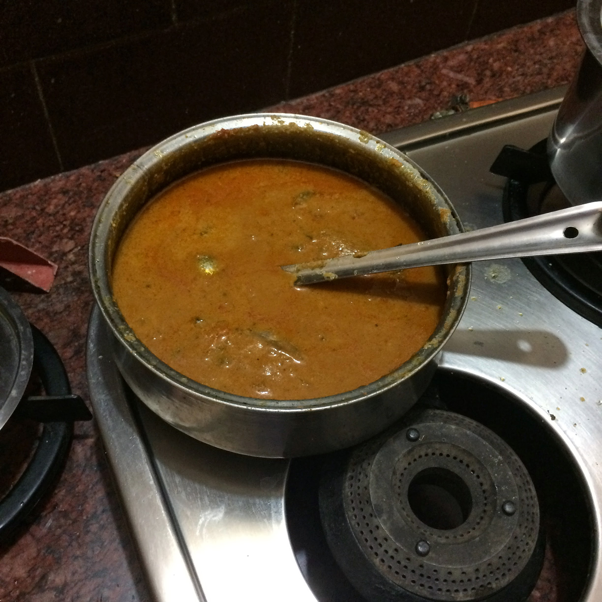

## Yenna kathirikka kozhambu

### Ingredients

- Onions - 1 big(Indian size)

- Tomatoes - 2 medium

- Garlic 4-5 cloves

- Curry leaves, finely chopped

- Brinjal - 4, chop to stalk and cut at bottom to form plus shape

- Coconut - 1/2, grind into paste

- Tamarind - add to taste, soak in water

- Turmeric powder

- Salt

- Chilli powder

### Procedure

1. Add all ingredients except Brinjal to a bowl.

2. Add Turmeric powder, 3/4 teaspoons of salt and 5 teaspoons of chilli powder(the chilli powder
hides the sourness from the tamarind.)

3. Mix all ingredients with hands.

4. Stuff the brinjals with this spice mixture.
Sidenote - Vadiyam can be used instead of cumin/mustard seasoning, this has to be stored in air-tight
container in the fridge.

6. Add 5 table spoons of oil to a pan.

7. Add a pinch of vadiyam, note - this smells really good.

8. Add everything everything except tamarind to this mixture including Brinjal.

9. Keep checking bottom of the pan.

10. Add very little water if the stuff at the bottom looks close to getting burnt. Add water in very small
quantities.

11. Cook for about 10-15 minutes.

12. Add Tamarind right at the end.

13. Add oil at the end, a layer of oil must be visible.

14. Taste a teaspoon and add salt/chilli-powder/turmeric as needed.

Note - the name yenna kathirikka literally means oil and brinjal. Brinjal is eggplant if you're from America.

### Images of the recipe

